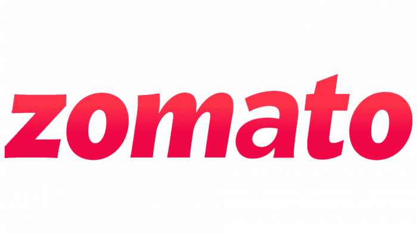

# Zomato Exploratory Data Analysis (EDA) Project

## Overview

This project involves an exploratory data analysis (EDA) of Zomato's dataset, which includes various features related to restaurants listed on the platform. The primary goal is to gain insights into the data, identify patterns, and understand the distribution and relationships among different features.

## Objective

The main objective of this EDA project is to:

1. Understand the structure and distribution of the data.
2. Identify any patterns or trends in the data.
3. Discover relationships between different features.
4. Gain insights that can help improve business strategies for restaurants listed on Zomato.

## Concepts and Techniques Used

### 1. Data Cleaning

Data cleaning is the process of detecting and correcting (or removing) corrupt or inaccurate records from a dataset. It involves handling missing values, correcting data types, and removing duplicates. In this project, data cleaning ensures that the dataset is ready for analysis.

### 2. Data Visualization

Data visualization is the graphical representation of information and data. By using visual elements like charts, graphs, and maps, data visualization tools provide an accessible way to see and understand trends, outliers, and patterns in data.

#### Techniques Used:
- **Bar Charts**: Used to compare the frequency of categorical variables.
- **Histograms**: Used to understand the distribution of numerical variables.
- **Box Plots**: Used to display the distribution of data and identify outliers.
- **Scatter Plots**: Used to identify relationships between two numerical variables.
-**Distribution Graph**:Used to distribute the realtion between variables.

### 3. Feature Engineering

Feature engineering involves creating new features from existing data to improve the performance of machine learning models. In this project, feature engineering helps in transforming and optimizing the dataset for better analysis.

### 4. Descriptive Statistics

Descriptive statistics involves summarizing and organizing the data so it can be easily understood. Measures of central tendency (mean, median, mode) and measures of variability (range, variance, standard deviation) are used to describe the main features of the dataset.

### 5. Correlation Analysis

Correlation analysis is used to study the strength and direction of the relationship between two continuous variables. It helps in understanding how one variable may predict another.

## Data Used

The dataset contains various features related to restaurants, including:

- Restaurant Name
- Location
- Cuisines Offered
- Average Cost for Two
- Rating
- Number of Votes
- Restaurant Type
- City
- ... and more.

## Conclusion

This EDA project on Zomato's dataset provides valuable insights into the data and helps in understanding the factors that can influence the success of a restaurant on the platform. By leveraging data cleaning, visualization, feature engineering, and correlation analysis, we can derive meaningful conclusions that can assist in strategic decision-making for restaurants.

---

This README provides a theoretical overview of the concepts and techniques used in the Zomato EDA project. For detailed code implementation and analysis, please refer to the project files.
